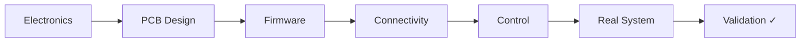

<!-- =========================================================
     CLAUDIO "NACHO" TAPIA — GITHUB PROFILE
     ========================================================= -->

  

  

---

## ⚡ About Me

I'm an **Electronics Engineer** focused on **embedded systems, firmware, hardware design, robotics and IoT**.

🏭 **Firmware & Hardware Developer | Embedded Systems & IoT @ Ingeagro**

🎓 **Electronic Engineering + M.Sc. @ Universidad Técnica Federico Santa María 🇨🇱**

🚗 Currently working with **autonomous vehicle platooning, robotics and embedded control systems**.

🤖 I use **AI agents and AI-assisted engineering workflows** to accelerate software, firmware, research and engineering development.

🔧 I enjoy taking projects from **schematics and PCB design to firmware, integration and physical validation**.

---

## ⚙️ What I Work On

  
  
  
  
  

---

## 🔩 Engineering Workflow

  <b>Build · Measure · Validate · Improve</b>

---

# 🧰 Engineering Toolbox

### 💻 Languages

  
  
  
  
  

### ⚡ Embedded & Computing

  
  
  
  
  
  

### 📡 IoT & Connectivity

  
  
  

### 🔧 Hardware & PCB

  
  
  
  
  

### 🤖 Robotics, Control & Vision

  
  
  
  
  

### 🛠️ Development

  
  
  
  
  

### 🧠 AI-Assisted Engineering

  
  
  
  

---

## 🚀 Selected Areas

| 🚗 Autonomous Systems | 📡 Industrial IoT & Embedded Systems | ⚙️ Industrial Automation |
| :---: | :---: | :---: |
| Robotics | Embedded Firmware | Motor Control |
| Control Systems | Sensors & Instrumentation | Electronics |
| Computer Vision | Wireless Communication | Embedded Firmware |
| Embedded Systems | Mobile Integration | Instrumentation |

---

## 📊 GitHub Activity

  
  

<!--
Next visual experiment:
Pac-Man / Contribution Snake / 3D Contribution Graph

We'll test them separately and keep only one.
-->

---

## 🤝 Connect With Me

  

  

 

  <b>⚡ Build · Measure · Validate · Improve.</b>

